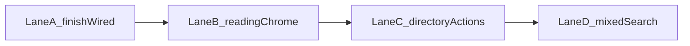

# UX bells — Lanes A–D only, one at a time

Scope is **A then B then C then D**. Do not mix lanes in the same pass. Do not implement E (crisis chrome) or F (new authoring blocks). Command palette mounts only at the end of D, after typeahead works.

Stay on existing routes and tokens. No dark mode, auth, maps embed, PWA, or push.

---

## Lane A — Finish what is already wired (this pass)

- Featured services on home: project `commonServiceFields`, honor `showFeaturedServices`, render `ServiceCard` grid in [home-page.tsx](frontend/app/(site)/(home)/home-page.tsx).
- CTA buttons: `Button asChild` + `ResolvedLink` in [cta.tsx](frontend/app/components/shared/cta.tsx). Include `href` (and post `categorySlug`) in `linkReference` so URL/post links resolve.
- Author byline: uncomment `Avatar` in [post-template.tsx](frontend/app/(site)/[...slug]/_components/post-template.tsx); `font-sans` on the byline.
- Footer: render [footerNav](studio/src/schemas/singletons/navigation.ts) when present; keep the primaryNav heuristic as fallback so an empty CMS field does not blank the footer. Keep Connect/email.
- Portable text: `h4`, `blockquote`, `small` in [portable-text.tsx](frontend/app/components/shared/portable-text.tsx); include `h4` in the TOC headings query.
- Sitemap: pages, posts, tribes, services, categories, topics, plus index routes `/tribes`, `/services`, `/search`, `/articles`, `/guides`, `/tools`.
- Search copy: say “results”, not “posts”. Full empty-state + chips wait for D.
- Do **not** mount the command palette.

Skip: `next-pwa`, `web-push`, `get-started-code`, unused `posts.tsx` onboarding.

---

## Lane B — Editorial reading chrome (after A)

Breadcrumbs on post/tribe/service/category. `lastReviewed` datetime + reading time. Share / copy link / print action bar (44px, `focus-ring`). Related posts queried by topic. Document on `/admin/design/patterns`.

**Out of this lane:** callout/warning/steps blocks (Lane F).

---

## Lane C — Directory actions (after B)

Contact rows: 44px targets + `focus-ring`. Open in maps from address. Copy phone/address. Share listing (reuse B’s share control).

**Out of this lane:** open-now, pack-a-list, ZIP/distance, map embed.

---

## Lane D — Search as a mixed index (after C)

Type chips (All / Articles / Guides / Tools / Services / Tribes). Honest counts. Empty state with links to `/tribes` and `/services`. Typeahead under HeroSearch. Then mount command palette. Fail closed when Algolia is unset (existing 5xx skip).

---

## Explicitly deferred

- **Lane E:** hide-website label, Esc, history-burying, safety note, Get Help singleton.
- **Lane F:** portable-text callouts/steps, tags, structured hours, submit-a-resource.
- Dark mode, accounts, interactive maps, PWA, web push.
